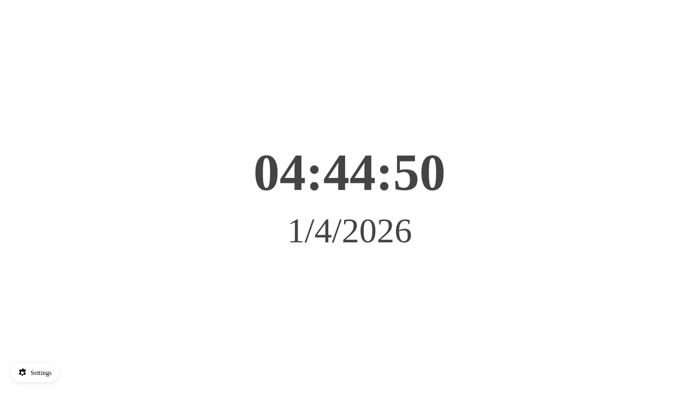
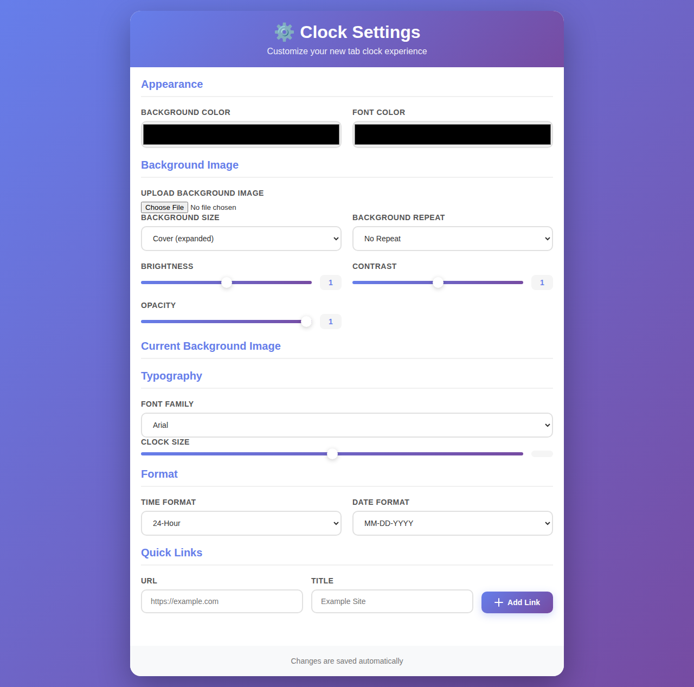

# New Tab Clock - Chrome Extension

A beautiful, minimalistic Chrome extension that transforms your new tab into an elegant digital clock with customizable appearance and quick links.



## Features

✨ **Clean & Minimalist Design** - A distraction-free clock display that replaces your default new tab page

⏰ **Real-Time Clock** - Displays the current time with smooth second-by-second updates

📅 **Date Display** - Shows the current date alongside the time

🎨 **Fully Customizable** - Personalize every aspect of your clock:
- **Colors**: Custom background and font colors
- **Typography**: Choose from multiple font families and adjust clock size
- **Background Images**: Upload and customize your own background images with:
  - Image cropping tool
  - Adjustable brightness, contrast, and opacity
  - Flexible sizing (cover, contain, auto)
  - Repeat options
- **Time Formats**: Switch between 12-hour and 24-hour formats
- **Date Formats**: Choose between MM-DD-YYYY and DD-MM-YYYY

🔗 **Quick Links** - Add and manage your favorite websites directly on your new tab for easy access

💾 **Auto-Save** - All settings are automatically saved and synced across your Chrome browser

## Screenshots

### Main Clock View

*A clean, minimalist clock display showing time and date*

### Settings Page

*Comprehensive customization options for appearance, typography, formats, and quick links*

## Installation

### From Chrome Web Store
Install the extension directly from the [Chrome Web Store](https://chromewebstore.google.com/detail/new-tab-clock/jolmfkcegldneaehnpnmfgjnfelokcdd).

### Manual Installation (Development)
1. Clone this repository or download the source code
2. Open Chrome and navigate to `chrome://extensions/`
3. Enable "Developer mode" in the top right corner
4. Click "Load unpacked" and select the `src` directory from this repository
5. The extension should now be installed and active!

## Usage

1. **Open a New Tab** - Simply open a new tab in Chrome to see the clock
2. **Access Settings** - Click the "Settings" link in the bottom-left corner of the new tab page
3. **Customize Your Clock** - Adjust colors, fonts, formats, and add your favorite links
4. **Changes Save Automatically** - Your preferences are saved instantly

## Development

### Project Structure
```
new-tab-clock-extension/
├── src/
│   ├── index.html          # Main new tab page
│   ├── options.html        # Settings page
│   ├── script.js           # Main clock logic
│   ├── options.js          # Settings page logic
│   ├── background.js       # Background service worker
│   ├── content.js          # Content script
│   ├── style.css           # Main page styles
│   ├── options.css         # Settings page styles
│   ├── manifest.json       # Extension manifest
│   └── icons/              # Extension icons
├── screenshots/            # Documentation screenshots
└── README.md
```

### Technologies Used
- **HTML/CSS/JavaScript** - Core web technologies
- **Chrome Extension APIs** - Storage API for saving user preferences
- **Cropper.js** - Image cropping functionality for background images

### Local Development
1. Clone the repository:
   ```bash
   git clone https://github.com/lpolish/new-tab-clock-extension.git
   cd new-tab-clock-extension
   ```

2. Load the extension in Chrome:
   - Open `chrome://extensions/`
   - Enable "Developer mode"
   - Click "Load unpacked" and select the `src` directory

3. Make your changes to the code

4. Reload the extension in `chrome://extensions/` to see your changes

## Contributing

We welcome contributions! Please see our [CONTRIBUTING.md](CONTRIBUTING.md) file for guidelines.

### Ways to Contribute
- 🐛 Report bugs by opening an issue
- 💡 Suggest new features or enhancements
- 🔧 Submit pull requests with bug fixes or new features
- 📖 Improve documentation
- 🌍 Help translate the extension

## License

This project is licensed under the MIT License - see the [LICENSE](LICENSE) file for details.

## Support

If you encounter any issues or have questions:
- Open an issue on [GitHub](https://github.com/lpolish/new-tab-clock-extension/issues)
- Check existing issues for solutions

## Changelog

See [CHANGELOG.md](CHANGELOG.md) for version history and updates.

---

Made with ❤️ by [lpolish](https://github.com/lpolish)
